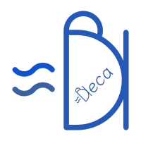

# Deca language syntax highlighting for Visual Studio Code

Deca is a Java-like, but much smaller programming language mainly for educational purpose.

This extension allows you to have a syntax highlighter for this programming language.

## Credits

This extension is mostly a re-use of the __Decaf__ extension that you can find here !
    
[Repository](https://github.com/equation314/decaf-vscode) | [decaf-lang](https://github.com/decaf-lang/decaf)

## Features

* Syntax highlighting
* Autoclosing brackets/quotes

## Installation

Linux: drag and drop the _deca-vscode_ folder into _~/.vscode/extensions_.